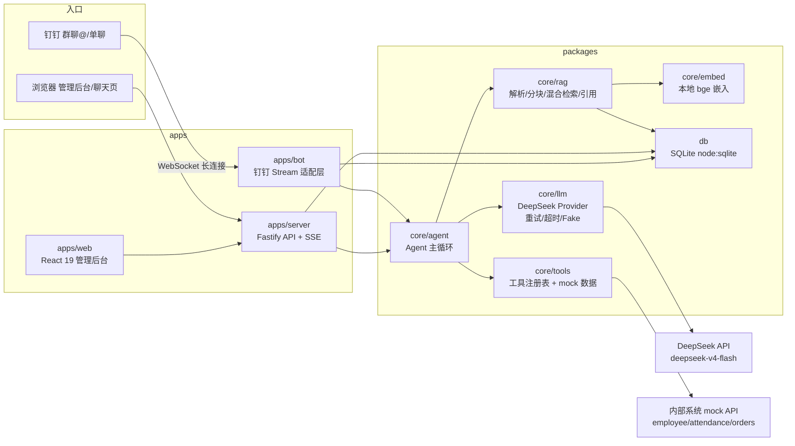

# 小苏 · 公司内部 AI 助手

「小苏」是苏云科技（虚构）的内部 AI 助手：员工在**钉钉**里 @ 它或用**网页**向它提问，它能基于公司知识库（员工手册、FAQ、制度文档）带引用地回答，也能自主调用工具查询员工 / 考勤 / 订单等内部系统；管理员通过 **Web 管理后台**维护知识库、查看对话日志。

> 本项目为「公司内部 AI 助手」笔试题的完整实现，仓库公开。所有代码为本项目原创（依赖第三方开源库见下方技术栈）。

## 功能一览

| 模块 | 能力 |
|---|---|
| 📚 知识库 | 上传/列表/删除 Markdown、PDF、Word、TXT 文档；索引状态（pending/indexed/failed）；**同名文件按内容哈希增量更新**（同内容跳过、不同内容替换重索引） |
| 💬 智能问答 | 混合检索（本地 bge 嵌入 + BM25）+ DeepSeek 生成；答案带引用并可**点击跳转高亮原文**；多轮上下文；流式输出；检索不到时**明确拒答不瞎编**；引用编号后端校验防虚构 |
| 🔧 工具调用 | 模型自主决定调用：员工信息、考勤、订单（3 个 mock 内部 API）、当前时间、计算器；mock 数据**按当前日期相对生成**，任何时候演示"上周"都有数据 |
| 📱 钉钉机器人 | Stream 长连接模式（无需公网），群聊 @ 与单聊均可；上下文按 (用户 + 会话) 隔离；回复带引用来源；错误兜底话术 |
| 🖥️ 管理后台 | 文档管理、全量对话日志（谁问了什么/工具/token/成本/耗时）、模型切换、IM 连接状态、备用聊天页 |

## 架构

单进程单体：Fastify 同时承载 HTTP API、静态前端与钉钉长连接客户端，SQLite 持久化；钉钉与 Web 两条入口复用同一个 Agent 核心。



### 一次问答的完整链路

1. 收到消息（钉钉事件或 `POST /api/chat`）→ 按 `(platform, userId, conversationId)` 定位会话并读取历史；
2. 检索知识库：查询向量化（本地 bge-small-zh）→ 向量余弦 + BM25 混合打分 → top-k 上下文；
3. DeepSeek 自主决策：直接作答（要求标注 `[C#]` 引用）或发起工具调用；
4. 工具结果注入后继续对话（最多 3 轮工具循环）→ 生成最终答案（Web 端流式输出）；
5. 后端校验引用编号只允许指向真实检索结果，剔除越界引用后落库（消息、工具、token、成本、耗时）。

## 技术栈

| 层 | 选型 |
|---|---|
| 运行时 | Node.js ≥ 22.5（开发于 v24），TypeScript 全栈 ESM（无 commonjs） |
| 包管理 | pnpm workspace monorepo（单文件 ≤500 行、源码目录 ≤8 文件） |
| 后端 | Fastify 5（REST + SSE 流式 + multipart 上传） |
| 前端 | React 19 + Vite + Tailwind CSS 4 + react-markdown |
| 数据 | SQLite（`node:sqlite` 内置驱动，零外部服务） |
| 模型 | DeepSeek（OpenAI 兼容协议，`deepseek-v4-flash` / `deepseek-v4-pro` 可切换） |
| 嵌入 | 本地 `bge-small-zh-v1.5`（transformers.js + onnxruntime-node，可切远程 OpenAI 兼容嵌入接口） |
| 钉钉 | 官方 `dingtalk-stream` SDK（Stream 模式，WebSocket 长连接） |
| 日志 | pino + pino-roll（`logs/` 按天滚动） |
| 测试 | Vitest（含 Mock LLM 离线用例，不依赖真实 API） |

## 快速开始

```bash
# 0. 前置：Node ≥ 22.5、pnpm（npm i -g pnpm）、Git Bash（Windows 运行 .sh 用）

# 1. 安装依赖
pnpm install

# 2. 配置密钥
cp .env.example .env   # 填写 DeepSeek API Key；要接钉钉再填 AppKey/AppSecret

# 3. 生成种子数据（mock 接口 JSON + PDF/DOCX/TXT 测试文档）
bash scripts/seed.sh

# 4. 一键启动（后端 :3000 + 前端 :5173）
bash scripts/dev.sh
```

打开 http://localhost:5173 → 文档库页上传 `data/seed/` 下的示例文档（也可用 `pnpm exec tsx scripts/smoke-upload.ts` 一键上传）→ 聊天测试页提问。

生产模式：`bash scripts/build.sh && bash scripts/start.sh`（单端口 :3000 托管前后端）。

测试：`bash scripts/test.sh`（17 条用例，全部离线可跑）。

## 目录结构

```
apps/server/    Fastify：路由（documents/chat/logs/settings/mock/status）+ 服务编排 + 启动
apps/bot/       钉钉 Stream 适配（事件解析/去重/sessionWebhook 回复/兜底）
apps/web/       React 管理后台（文档库/日志/设置/聊天页/原文高亮）
packages/core/  Agent/RAG/LLM Provider/嵌入器/工具注册表/prompt（平台无关，可复用）
packages/db/    SQLite 仓储（文档/分块/会话/消息/设置/心跳）
scripts/        dev/build/test/start/seed + 冒烟脚本（*.sh 统一入口）
tests/          Vitest（RAG/工具决策/增量更新/会话隔离/HTTP）
data/           seed 知识库文档、mock 内部数据（uploads 与 *.db 运行时生成，不入库）
logs/           运行时日志（不入库）
```

## 钉钉机器人接入指南（Stream 模式，无需公网）

1. 用个人手机号在 [钉钉开放平台](https://open.dingtalk.com) 注册，创建**测试组织**；
2. 开发者后台 → 创建**企业内部应用**（名称如「小苏」）→ 记下 **AppKey / AppSecret**；
3. 应用能力 → 添加**机器人** → 消息接收模式选 **Stream** → 保存并**发布**版本；
4. `.env` 中设置 `DINGTALK_ENABLED=true` 与 `DINGTALK_APP_KEY/SECRET`，重启服务；
5. 把测试成员（如面试官）加入测试组织，建群并把机器人拉进群 → @小苏 提问；单聊可直接搜索机器人私聊。

> 常见问题：机器人不回消息时先看 `logs/` 与后台「设置」页的 IM 状态；Stream 模式对机器人消息有频率限制（单人测试无影响）。

## 验收清单对照（笔试题 7.1–7.6）

- [x] 7.1 基础问答带引用（年假/报销/入职，命中员工手册与 FAQ）
- [x] 7.2 工具调用（员工接口 / 订单接口+自算 / 时间工具）
- [x] 7.3 多轮对话（IM 内按用户+会话隔离，"他"指代上一轮员工）
- [x] 7.4 拒答（知识库外的问题明确说"文档里没找到"，引用编号校验防瞎编）
- [x] 7.5 鲁棒性（改坏 API Key 后 IM/网页均有友好兜底，不无限等待）
- [x] 7.6 管理后台（全部对话日志、上传新文档即命中、删除即失效）

## Roadmap

- [ ] 多模型适配 UI（Provider 抽象已就绪，可接 OpenAI/智谱/硅基流动）
- [x] Evals：22 条自动化评测（`bash scripts/eval.sh`，需要真实 API Key）
- [ ] IM 富消息：ActionCard「查看原文」按钮（配置 `PUBLIC_BASE_URL` 后启用）
- [ ] 多端 IM：飞书/企业微信复用 `core` Agent（`apps/bot` 抽平台接口）
- [ ] Token/成本看板聚合视图
- [ ] MCP server 化

## 许可证

MIT © 2026 XiaoSu contributors
