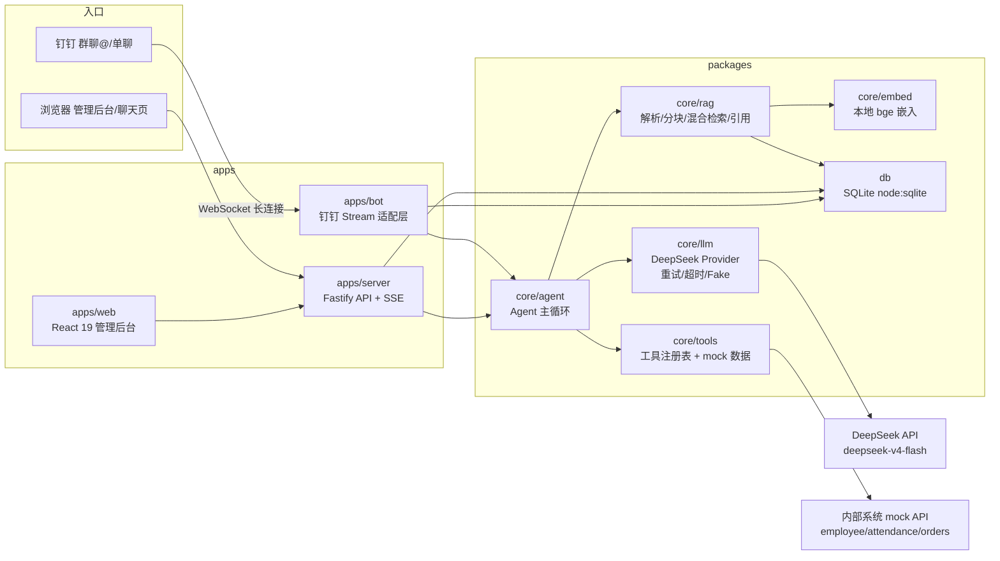

# 小苏 · 公司内部 AI 助手

「小苏」是苏云科技（虚构）的内部 AI 助手：员工在**钉钉**里 @ 它、或通过**网页**向它提问，它能基于公司知识库（员工手册、FAQ、制度文档）**带引用**地回答，也能**自主调用工具**查询员工 / 考勤 / 订单等内部系统；管理员通过 **Web 管理后台**维护知识库、查看每一次对话的完整日志（谁问了什么、调了哪些工具、花了多少 token 多少钱）。

> 本项目为「公司内部 AI 助手」招聘笔试题的完整实现，仓库公开。代码为本项目原创，依赖的第三方开源库见下方技术栈。

## 目录

- [一、项目介绍](#一项目介绍)
- [二、功能一览](#二功能一览)
- [三、截图](#三截图)
- [四、架构](#四架构)
- [五、技术栈](#五技术栈)
- [六、安装](#六安装)
- [七、使用](#七使用)
- [八、钉钉机器人接入](#八钉钉机器人接入)
- [九、验收清单对照](#九验收清单对照)
- [十、Roadmap](#十roadmap)

## 一、项目介绍

### 它解决什么问题

| 痛点 | 小苏的解法 |
|---|---|
| 年假 / 报销 / 加班等制度问题反复问 HR | 知识库问答：从员工手册、FAQ 等文档检索出答案，**并附原文出处** |
| 员工 / 考勤 / 订单数据散在多个系统，没人汇总 | 工具调用：模型自主判断何时查 `/api/employee`、`/api/attendance`、`/api/orders` |
| 通用 AI 答完不可追溯、可能瞎编 | 答案强制带引用；检索不到时**明确拒答**；引用编号后端校验，防止编造 |
| 知识没有沉淀、无法复盘 | 后台记录每一次对话（问题、回答、工具、token、成本、耗时） |

### 核心亮点

- **双入口、一套大脑**：钉钉机器人与 Web 聊天页复用同一个 Agent 核心（`packages/core`），消息处理逻辑不重复实现，为多端扩展留好了口子；
- **本地嵌入、零向量服务**：RAG 的向量化用本地 `bge-small-zh-v1.5`（首次自动下载，之后完全离线），不依赖云端向量数据库；
- **模型自主决策**：文档问答 / 工具调用不是写死的 if-else，而是由 DeepSeek 通过 function calling 自己判断该查文档还是调工具；
- **防瞎编三层护栏**：检索不到即拒答 + 引用编号必须落在真实检索结果内 + 答案必须带逐字原文摘录；
- **一条命令演示**：`bash scripts/dev.sh` 起后端 + 前端；钉钉走 Stream 长连接，**无需公网服务器**，面试官加入测试组织即可远程验收。

## 二、功能一览

| 模块 | 能力 |
|---|---|
| 📚 知识库 | 上传 / 列表 / 删除 Markdown、PDF、Word、TXT 文档；索引状态（pending / indexed / failed）；**同名文件按内容哈希增量更新**（同内容跳过、不同内容替换重索引） |
| 💬 智能问答 | 混合检索（本地 bge 嵌入 + BM25）+ DeepSeek 生成；答案带引用并**点击跳转高亮原文**；多轮上下文；流式输出；检索不到时**明确拒答不瞎编**；引用编号后端校验防虚构 |
| 🔧 工具调用 | 模型自主决定调用：员工信息、考勤、订单（3 个 mock 内部 API）、当前时间、计算器；mock 数据**按当前日期相对生成**，任何时候演示「上周」都有数据 |
| 📱 钉钉机器人 | Stream 长连接模式（无需公网），群聊 @ 与单聊均可；上下文按（用户 + 会话）隔离；回复带引用来源；错误兜底话术 |
| 🖥️ 管理后台 | 文档管理、全量对话日志（谁问了什么 / 工具 / token / 成本 / 耗时）、模型切换、IM 连接状态、备用聊天页 |

## 三、截图


<!--
  截图占位：请把运行截图放到本仓库的 docs/ 或 assets/ 目录，
  然后按下面格式引用（图片相对 README 的路径）：

  ### 管理后台 · 文档库
  

  ### 聊天页 · 带引用高亮
  

  ### 钉钉机器人 · 群聊问答
  

  建议至少 3 张：① Web 文档库/日志页 ② 聊天页带引用高亮 ③ 钉钉里的一次问答。
-->

## 四、架构

单进程单体：Fastify 同时承载 HTTP API、静态前端与钉钉长连接客户端，SQLite 持久化；钉钉与 Web 两条入口复用同一个 Agent 核心。



### 分层说明

| 层 | 职责 | 关键目录 |
|---|---|---|
| 入口层 | 钉钉事件解析 / Web 请求路由，把消息统一交给 Agent | `apps/bot`、`apps/server/src/routes` |
| 智能层 | Agent 主循环、RAG 检索、LLM 调用、工具注册（**平台无关，可复用**） | `packages/core` |
| 数据层 | 文档 / 分块 / 会话 / 消息 / 设置 / 心跳的 SQLite 仓储 | `packages/db` |
| 前端层 | 管理后台（文档库 / 日志 / 设置 / 聊天页 / 原文高亮） | `apps/web` |

### 一次问答的完整链路

1. 收到消息（钉钉事件或 `POST /api/chat`）→ 按 `(platform, userId, conversationId)` 定位会话并读取历史；
2. 检索知识库：查询向量化（本地 bge-small-zh）→ 向量余弦 + BM25 混合打分 → top-k 上下文；
3. DeepSeek 自主决策：直接作答（要求标注 `[C#]` 引用）或发起工具调用；
4. 工具结果注入后继续对话（最多 3 轮工具循环）→ 生成最终答案（Web 端流式输出）；
5. 后端校验引用编号只允许指向真实检索结果，剔除越界引用后落库（消息、工具、token、成本、耗时）。

### 目录结构

```
apps/server/    Fastify：路由（documents/chat/logs/settings/mock/status）+ 服务编排 + 启动
apps/bot/       钉钉 Stream 适配（事件解析/去重/消息回复/AI 卡片流式打字机/兜底）
apps/web/       React 管理后台（文档库/日志/设置/聊天页/原文高亮）
packages/core/  Agent/RAG/LLM Provider/嵌入器/工具注册表/prompt（平台无关，可复用）
packages/db/    SQLite 仓储（文档/分块/会话/消息/设置/心跳）
scripts/        dev/build/test/start/seed/eval + 冒烟脚本（*.sh 统一入口）
tests/          Vitest（RAG/工具决策/增量更新/会话隔离/HTTP/AI 卡片请求体）
data/           seed 知识库文档、mock 内部数据（uploads 与 *.db 运行时生成，不入库）
logs/           运行时日志（不入库）
```

## 五、技术栈

| 层 | 选型 | 版本 / 说明 |
|---|---|---|
| 运行时 | Node.js + TypeScript | Node ≥ 22.5（开发于 v24），全栈 ESM（无 commonjs） |
| 包管理 | pnpm workspace monorepo | pnpm 11（单文件 ≤500 行、源码目录 ≤8 文件） |
| 后端 | Fastify | v5（REST + SSE 流式 + multipart 上传） |
| 前端 | React + Vite + Tailwind CSS | React 19、Vite、Tailwind CSS 4、react-markdown |
| 数据 | SQLite | `node:sqlite` 内置驱动，零外部服务 |
| 对话模型 | DeepSeek | OpenAI 兼容协议，`deepseek-v4-flash` / `deepseek-v4-pro` 可切换 |
| 嵌入模型 | 本地 `bge-small-zh-v1.5` | transformers.js + onnxruntime-node（可切远程 OpenAI 兼容嵌入接口） |
| 钉钉 | 官方 `dingtalk-stream` SDK | Stream 模式，WebSocket 长连接 |
| 日志 | pino + pino-roll | `logs/` 按天滚动 |
| 测试 | Vitest | 含 Mock LLM（FakeProvider）离线用例，不依赖真实 API |

## 六、安装

### 前置要求

- **Node.js** ≥ 22.5（建议 24.x）
- **pnpm**：`npm install -g pnpm`
- **Git Bash**：Windows 上运行 `scripts/*.sh` 需要（项目已附 `启动小苏.bat` 双击启动）

### 步骤

```bash
# 1. 拉取并进入项目
git clone <你的仓库地址> && cd xiaosu

# 2. 安装依赖
pnpm install

# 3. 配置密钥
cp .env.example .env
# 编辑 .env，至少填 LLM_API_KEY；要接钉钉再填 DINGTALK_APP_KEY / DINGTALK_APP_SECRET

# 4. 生成种子数据（mock 接口 JSON + PDF/DOCX/TXT 测试文档）
bash scripts/seed.sh

# 5. 一键启动（后端 :3000 + 前端 :5173）
bash scripts/dev.sh
```

打开 http://localhost:5173 → 文档库页上传 `data/seed/` 下的示例文档（也可 `pnpm exec tsx scripts/smoke-upload.ts` 一键上传）→ 聊天测试页提问。

### 环境变量一览

| 变量 | 默认值 | 说明 |
|---|---|---|
| `LLM_BASE_URL` | `https://api.deepseek.com` | 对话模型 API 地址 |
| `LLM_API_KEY` | 空（**必填**） | DeepSeek API Key |
| `LLM_MODEL` | `deepseek-v4-flash` | 对话模型，可切 `deepseek-v4-pro` |
| `LLM_THINKING` | `default` | `default` 思考模式 / `disabled` 关闭（更快更省、工具路由更稳） |
| `EMBED_PROVIDER` | `local` | `local` 本地嵌入 / `remote` 远程接口 / `fake` 离线测试 |
| `EMBED_MODEL` | `Xenova/bge-small-zh-v1.5` | 嵌入模型 |
| `EMBED_BASE_URL` / `EMBED_API_KEY` | 空 | 仅在 `EMBED_PROVIDER=remote` 时填写 |
| `HF_ENDPOINT` | `https://hf-mirror.com` | 国内镜像，huggingface 下载失败时用 |
| `DINGTALK_ENABLED` | `false` | 是否启用钉钉机器人 |
| `DINGTALK_APP_KEY` / `DINGTALK_APP_SECRET` | 空 | 钉钉应用凭据 |
| `DINGTALK_AI_CARD` | `true` | 是否启用 AI 卡片流式打字机 |
| `PORT` | `3000` | 后端服务端口 |
| `PUBLIC_BASE_URL` | 空 | 公网地址（部署后填，用于 IM 里「查看原文」链接） |
| `DB_PATH` | `./data/xiaosu.db` | SQLite 文件路径 |
| `LOG_DIR` | `./logs` | 日志目录 |

> 完整注释版见 `.env.example`。

### 常见问题

- **Windows 控制台乱码 / 闪退**：`scripts/dev.sh` 已内置 UTF-8 代码页切换、关闭 ANSI 彩色、失败停留显示原因；也可直接双击根目录 `启动小苏.bat`。
- **端口 3000 被占用**：脚本会提示并退出，先停掉旧进程再重启。
- **本地嵌入模型下载慢 / 失败**：在 `.env` 中确认 `HF_ENDPOINT=https://hf-mirror.com`（国内镜像）。

## 七、使用

### 开发 / 生产 / 测试 / 评测

| 命令 | 作用 |
|---|---|
| `bash scripts/dev.sh` | 开发模式：后端 :3000 + 前端 :5173（改代码热更新） |
| `bash scripts/build.sh` | 全量类型检查（core/db/server/bot/web）+ 构建前端产物 |
| `bash scripts/start.sh` | 生产模式：单端口 :3000 托管前后端（需先 build） |
| `bash scripts/test.sh` | 运行全部测试：40 条用例全部离线可跑（含 Mock LLM） |
| `bash scripts/seed.sh` | 生成种子数据（mock JSON + PDF/DOCX/TXT） |
| `bash scripts/eval.sh` | 运行 Evals 评测（需真实 `LLM_API_KEY`） |

### Web 管理后台（管理员）

- **文档库**：上传 / 列表 / 删除文档，查看索引状态，同名文件自动增量更新；
- **日志**：查看所有对话（问题、回答、触发工具、token、成本、耗时）；
- **设置**：切换模型、查看 IM 连接状态；
- **聊天页**：备用对话页，方便调试与面试演示（带原文高亮跳转）。

### 对话测试（终端员工侧，钉钉或网页聊天页）

1. 「员工每年有几天年假？」→ 命中员工手册，带引用；
2. 「员工 001 是哪个部门的？」→ 调 `/api/employee/001`；
3. 「上周一共多少订单？」→ 调 `/api/orders` 并自己算汇总；
4. 接着问「他上周来上班几天？」→ 理解「他」= 员工 001，再调考勤 API；
5. 「我们公司 CEO 的家庭住址是？」→ 明确拒答，不瞎编。

### Mock 内部 API

| 接口 | 说明 |
|---|---|
| `GET /api/employee/:id` | 按工号查员工（如 `/api/employee/001`） |
| `GET /api/attendance?emp_id=&from=&to=` | 按员工 / 日期区间查考勤 |
| `GET /api/orders?from=&to=` | 按日期区间查订单，返回 `total` / `total_amount` / `records` |

## 八、钉钉机器人接入

钉钉 Stream 模式，**无需公网服务器**：

1. 用个人手机号在[钉钉开放平台](https://open.dingtalk.com)注册，创建**测试组织**；
2. 开发者后台 → 创建**企业内部应用**（名称如「小苏」）→ 记下 **AppKey / AppSecret**；
3. 应用能力 → 添加**机器人** → 消息接收模式选 **Stream** → 保存并**发布**版本；
4. `.env` 中设置 `DINGTALK_ENABLED=true` 与 `DINGTALK_APP_KEY/SECRET`，重启服务；
5. 把测试成员（如面试官）加入测试组织，建群并把机器人拉进群 → @小苏 提问；单聊可直接搜索机器人私聊。

### AI 卡片流式打字机（加分项，可选）

机器人默认以 **AI 卡片**回复：卡片显示「输入中」指示，正文**逐字打字机式输出**，结尾带「📚 来源」，状态转为完成。全部走站内 REST 调用，**无需公网地址**。

- 需在开发者后台「权限管理」开通 **Card.Instance.Write** 与 **Card.Streaming.Write** 两个权限，并**重新发布**应用；
- 未开通时自动降级为普通文本回复（不影响其他功能）；
- `.env` 中 `DINGTALK_AI_CARD=false` 可强制关闭卡片模式。

> 常见问题：机器人不回消息时先看 `logs/` 与后台「设置」页的 IM 状态；Stream 模式对机器人消息有频率限制（单人测试无影响）。

## 九、验收清单对照

对照笔试题 7.1–7.6 逐条自测：

- [x] 7.1 基础问答带引用（年假 / 报销 / 入职，命中员工手册与 FAQ）
- [x] 7.2 工具调用（员工接口 / 订单接口 + 自算 / 时间工具）
- [x] 7.3 多轮对话（IM 内按用户 + 会话隔离，「他」指代上一轮员工）
- [x] 7.4 拒答（知识库外的问题明确说「文档里没找到」，引用编号校验防瞎编）
- [x] 7.5 鲁棒性（改坏 API Key 后 IM / 网页均有友好兜底，不无限等待）
- [x] 7.6 管理后台（全部对话日志、上传新文档即命中、删除即失效）

## 十、Roadmap

- [ ] 多模型适配 UI（Provider 抽象已就绪，可接 OpenAI / 智谱 / 硅基流动）
- [x] Evals：23 条自动化评测（`bash scripts/eval.sh`，需要真实 API Key，当前 23/23）
- [x] IM 富消息：AI 卡片流式打字机（内置官方模板，需卡片权限）
- [ ] IM 富消息：ActionCard「查看原文」按钮（配置 `PUBLIC_BASE_URL` 后启用）
- [ ] 多端 IM：飞书 / 企业微信复用 `core` Agent（`apps/bot` 抽平台接口）
- [ ] Token / 成本看板聚合视图
- [ ] MCP server 化
- [ ] Evals 接入 CI（GitHub Actions 每次提交自动出准确率）

## 许可证

MIT © 2026 XiaoSu contributors
